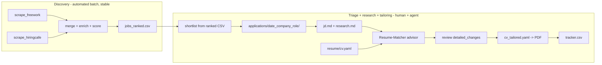

# Job Search Scraping

Multi-board job search pipeline: scrape, enrich, score, and rank job listings
from free-work.com and hiringcafe.com (extensible to any board via canonical schema).

Dagster DAG with 9 assets — topological execution, per-source stage toggling,
LLM enrichment via DeepSeek + instructor for structured output.

## Quick start

```bash
git clone https://github.com/evanokeefe39/job_search_scraping.git
cd job_search_scraping
uv sync

# Full pipeline (scrape both boards, enrich, score, export):
uv run python -m pipeline.run

# Or individual scrapers:
uv run python scrape_freework.py --format json
uv run python scrape_hiringcafe.py --max-pages 50
```

Application workflow is agent-driven (see `.agents/skills/`):

```bash
# 1. Refresh jobs and shortlist (run scrapers + enrichment, report delta)
/skill:jd-refresh

# 2. Scaffold an application folder and research the company
/skill:new-application

# 3. Tailor the master CV to the JD, review diffs, render PDF
/skill:tailor-resume
```

## Architecture

```
freework_jobs ──┐
                ├── merged_jobs ── translated ──┬── tech_extracted ──┐
hiringcafe_jobs─┘                               ├── vertical_classified┤
                                                └── company_stats ────┤
                                                                      scored_jobs ── ranked_csv
```

9 Dagster assets: 2 scrapers → merge → 4 enrichment stages → score → export.
Enrichment skips hiringcafe (pre-enriched by the source) and only processes free-work.

## Scrapers

| Board | File | Method | Auth |
|---|---|---|---|
| free-work.com | `scrape_freework.py` | HTML parsing (server-rendered) | None |
| hiringcafe.com | `scrape_hiringcafe.py` | Next.js SSR data route (JSON) | None |

Both output to a shared canonical schema (`schemas.py`) with normalized enums
for workplace type, contract type, seniority, role category, engagement, and company type.

## Canonical schema

All boards normalize to `CanonicalJob` with ~30 fields including typed `Salary`
(annual EUR), `CompanyInfo` (industry, size, funding, stock), and `_enrichment`
status tracking. See `schemas.py` for the full model.

## Enrichment pipeline

LLM enrichment for free-work jobs uses instructor (Pydantic-based structured
output) against DeepSeek's OpenAI-compatible API. Gemini Flash is configured
as an alternative (`LLM_PROVIDER=gemini` in `.env`).

| Stage | What it does | Free-work | HiringCafe |
|---|---|---|---|
| translate | FR → EN translation | DeepSeek | Skip (already EN) |
| tech_extract | Technologies, competencies, seniority, role | DeepSeek | Skip (pre-extracted) |
| vertical_classified | ESN/end-client detection, sector | DeepSeek | Skip (always direct) |
| company_stats | Company type, size, stock | Deferred | Skip (pre-enriched) |
| scored_jobs | Multi-dimension scoring | Rule-based | Rule-based |
| ranked_csv | Export scored CSV | All boards merged | |

### Configuration

```env
# .env
LLM_API_KEY=sk-...         # DeepSeek API key (default)
LLM_PROVIDER=deepseek       # or gemini (Gemini Flash, ~3x cheaper)
GEMINI_API_KEY=...          # only needed for LLM_PROVIDER=gemini
LLM_MAX_RPM=30              # rate limit
LLM_CONCURRENCY=5           # parallel LLM calls
```

### Scoring dimensions

Five weighted dimensions tuned for well-paid, flexible, moderate-responsibility data engineering roles:

| Dimension | Weight | Reads canonical field |
|---|---|---|
| Pay | 0.30 | `salary.min_annual_eur` / `salary.max_annual_eur` |
| Flexibility | 0.25 | `workplace_type`, `contract_types`, `contract_duration` |
| Low responsibility | 0.20 | `title`, `description_text`, `seniority_level`, `role_category` |
| Tech match | 0.15 | `technologies` (modern vs legacy) |
| Company quality | 0.10 | `company_info.org_type`, `posting_company_type`, `engagement_type` |

## Future boards

To add a new board:
1. Write a scraper that outputs `CanonicalJob` records (see `scrape_hiringcafe.py` for reference)
2. Add the scraper as a Dagster asset in `pipeline/assets.py`
3. Add the JSON path to `merged_jobs`

The enrichment stages automatically skip jobs with populated `_enrichment` flags.

## Application workspace

Discovery is automated; everything after shortlisting is an interactive,
per-role workflow operated with agent skills and human review gates.



### Skills

Playbooks in `.agents/skills/` drive the workflow; each stops at human gates.

| Skill | Orchestrates | Human gate |
|---|---|---|
| `jd-refresh` | Run scrapers + enrichment, report delta and top-ranked jobs | Shortlist selection |
| `new-application` | Scaffold application folder, write `jd.md`, research company (web search, yfinance, manual Crunchbase checkpoint), write `research.md` | Go/no-go on applying |
| `tailor-resume` | Start Resume-Matcher, run CV+JD through it, present diff log, apply approved changes to tailored YAML, render PDF, audit, track | Every diff; final PDF |
| `application-tracker` | `tracker.csv` transitions + response-rate stats | — |

### Canonical resume

`resume/cv.yaml` is the single master resume (RenderCV schema, gitignored —
this repo is PUBLIC, never commit personal data). Render with
`uv run rendercv render resume/cv.yaml`. Tailoring forks a copy per application
(`applications/<folder>/cv_tailored.yaml`); the master never changes.

### Services

`services/docker-compose.yml` runs Resume-Matcher only (`http://localhost:8000`),
started by the `tailor-resume` skill and torn down afterward — nothing is
always-on. ATSFlow and ats-resume-checker were retired in the 2026-08-06 rework;
ATSFlow's 30-rule scan is at most a one-time manual lint of the master template.

### Fabrication guard

`scripts/audit_alignment.py <original> <rewrite>` deterministically strips
claims the original can't support (skills and metrics absent from the master)
and exits 1 if anything was stripped. Resume-Matcher's built-in
master-alignment validation plus this audit are two lines of defense; the human
reviews the diff log regardless.

See `docs/ats_matcher_catalog.md` for the researched tool inventory and
`docs/matcher_contracts.md` for verified I/O contracts.
