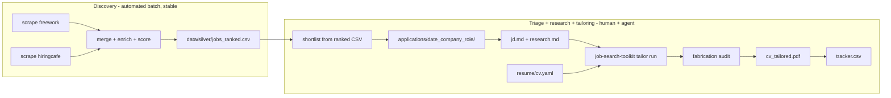

# Job Search Toolkit

Multi-board job search pipeline and application automation: scrape, enrich,
score, and rank job listings from free-work.com and hiringcafe.com
(extensible to any board via canonical schema), then drive the per-role
application workflow with agent skills.

Installable as a PyPI package (`job-search-toolkit`) with a single CLI
(`job-search-toolkit`) and agent skills that plug into any harness
(oh-my-pi, Claude Code, Codex).

```
scrape -> bronze -> silver -> gold
                   (DuckDB analytics)
```

## Quick start

```bash
pip install job-search-toolkit        # or: uv tool install job-search-toolkit

# Full pipeline (scrape both boards, merge, enrich, score, export):
job-search-toolkit pipeline run

# Load the silver dataset into the DuckDB gold layer:
job-search-toolkit pipeline gold

# Individual scrapers:
job-search-toolkit scrape freework --format json
job-search-toolkit scrape hiringcafe --max-pages 50

# Tailor the master CV to a job description (human-gated, renders PDF):
job-search-toolkit tailor run --yaml resume/cv.yaml --jd applications/FOLDER/jd.md

# Install the agent skills into your harness:
job-search-toolkit skills install --agent ompy    # or: claude | codex
```

From a repo checkout (no install needed):

```bash
uv sync
uv run python -m job_search_toolkit.pipelines.jd.run   # == job-search-toolkit pipeline run
```

## Data layout (medallion)

| Layer | Location | Content |
|---|---|---|
| Bronze | `data/bronze/` | Raw canonical per board (JSON + CSV) |
| Silver | `data/silver/` | `merged_jobs.json`, `jobs_ranked.csv`, enriched JSON |
| Gold | `data/gold/jobs.db` | DuckDB views: `ranked_jobs`, `by_sector`, `by_tier` |

## Architecture

```
src/job_search_toolkit/
├── cli.py                  # single entry point: scrape | pipeline | tailor | skills
├── schemas.py              # CanonicalJob + normalized enums
├── scrapers/               # freework.py, hiringcafe.py
├── pipelines/              # Domain pipelines
│   └── jd/                 # Dagster 9-asset graph + DuckDB gold layer
│       ├── definitions.py  # dg.Definitions(assets=[...])
│       ├── assets/         # scrape, merge, enrich, score
│       └── resources/      # LLM client
└── automation/tailor/      # resume tailoring engine (client, prompts, merge, audit, render)
skills/                     # plugin-standard agent skills (skills/<name>/SKILL.md)
```

Dagster DAG with 9 assets — topological execution, per-source stage toggling,
LLM enrichment via DeepSeek + instructor for structured output:

```
freework_jobs ──┐
                ├── merged_jobs ── translated ──┬── tech_extracted ──┐
hiringcafe_jobs─┘                               ├── vertical_classified┤
                                                └── company_stats ────┤
                                                                      scored_jobs ── ranked_csv
```

Enrichment skips hiringcafe (pre-enriched by the source) and only processes free-work.

## Scrapers

| Board | Module | Method | Auth |
|---|---|---|---|
| free-work.com | `scrapers/freework.py` | HTML parsing (server-rendered) | None |
| hiringcafe.com | `scrapers/hiringcafe.py` | Next.js SSR data route (JSON) | None |

Both normalize to the shared `CanonicalJob` schema with typed enums for
workplace type, contract type, seniority, role category, engagement, and company type.

## Enrichment pipeline

LLM enrichment for free-work jobs uses instructor (Pydantic-based structured
output) against DeepSeek's OpenAI-compatible API. Gemini Flash is configured
as an alternative (`LLM_PROVIDER=gemini` in `.env`).

| Stage | What it does | Free-work | HiringCafe |
|---|---|---|---|
| translate | FR → EN translation | DeepSeek | Skip (already EN) |
| tech_extract | Technologies, competencies, seniority, role | DeepSeek | Skip (pre-extracted) |
| vertical_classified | ESN/end-client detection, sector | DeepSeek | Skip (always direct) |
| company_stats | Company type, size, stock | Deferred | Skip (pre-enriched) |
| scored_jobs | Multi-dimension scoring | Rule-based | Rule-based |
| ranked_csv | Export scored CSV | All boards merged | |

### Configuration

```env
# .env
LLM_API_KEY=sk-...         # DeepSeek API key (default)
LLM_PROVIDER=deepseek       # or gemini (Gemini Flash, ~3x cheaper)
GEMINI_API_KEY=...          # only needed for LLM_PROVIDER=gemini
LLM_MAX_RPM=30              # rate limit
LLM_CONCURRENCY=5           # parallel LLM calls
```

### Scoring dimensions

Five weighted dimensions tuned for well-paid, flexible, moderate-responsibility data engineering roles:

| Dimension | Weight | Reads canonical field |
|---|---|---|
| Pay | 0.30 | `salary.min_annual_eur` / `salary.max_annual_eur` |
| Flexibility | 0.25 | `workplace_type`, `contract_types`, `contract_duration` |
| Low responsibility | 0.20 | `title`, `description_text`, `seniority_level`, `role_category` |
| Tech match | 0.15 | `technologies` (modern vs legacy) |
| Company quality | 0.10 | `company_info.org_type`, `posting_company_type`, `engagement_type` |

## Application workspace

Discovery is automated; everything after shortlisting is an interactive,
per-role workflow operated with agent skills and human review gates.



### Skills

Playbooks in `skills/` drive the workflow; each stops at human gates.
Install them into your harness with `job-search-toolkit skills install` (or add the
repo as a marketplace: `/marketplace add evanokeefe39/job_search_scraping`).

| Skill | Orchestrates | Human gate |
|---|---|---|
| `jd-refresh` | `job-search-toolkit pipeline run`, report delta and top-ranked jobs | Shortlist selection |
| `new-application` | Scaffold application folder, write `jd.md`, research company (web search, yfinance, manual Crunchbase checkpoint), write `research.md` | Go/no-go on applying |
| `tailor-resume` | `job-search-toolkit tailor run`, present audit, apply approved changes to tailored YAML, render PDF | Every diff; final PDF |
| `application-tracker` | `tracker.csv` transitions + response-rate stats | — |
| `market-research` | Multi-level job market trend analysis | Interpretation |
| `cold-outreach` | Find contacts, draft outreach messages | Send approval |

Each skill declares its requirements (Python 3.14+, uv) and assumes the
`job-search-toolkit` CLI is installed.

### Canonical resume

`resume/cv.yaml` is the single master resume (RenderCV schema, gitignored —
this repo is PUBLIC, never commit personal data). Render with
`uv run rendercv render resume/cv.yaml`. Tailoring forks a copy per application
(`applications/<folder>/cv_tailored.yaml`); the master never changes.

### Fabrication guard

`automation/tailor/audit.py:check_fabrication()` validates tailored YAML against
the master: experience count, company names, fabricated skills (with synonym
map), and fabricated metrics. Runs as a hard gate in the tailoring pipeline;
the human reviews any JD-derived additions flagged as verify-with-human.

See `docs/ats_matcher_catalog.md` for the researched tool inventory and
`docs/matcher_contracts.md` for verified I/O contracts.
