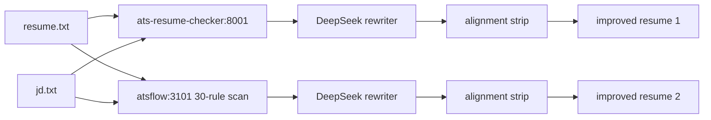

# Job Search Scraping

Multi-board job search pipeline: scrape, enrich, score, and rank job listings
from free-work.com and hiringcafe.com (extensible to any board via canonical schema).

Dagster DAG with 9 assets — topological execution, per-source stage toggling,
LLM enrichment via DeepSeek + instructor for structured output.

## Quick start

```bash
git clone https://github.com/evanokeefe39/job_search_scraping.git
cd job_search_scraping
uv sync

# Full pipeline (scrape both boards, enrich, score, export):
uv run python -m pipeline.run

# Or individual scrapers:
uv run python scrape_freework.py --format json
uv run python scrape_hiringcafe.py --max-pages 50
```

## Architecture

```
freework_jobs ──┐
                ├── merged_jobs ── translated ──┬── tech_extracted ──┐
hiringcafe_jobs─┘                               ├── vertical_classified┤
                                                └── company_stats ────┤
                                                                      scored_jobs ── ranked_csv
```

9 Dagster assets: 2 scrapers → merge → 4 enrichment stages → score → export.
Enrichment skips hiringcafe (pre-enriched by the source) and only processes free-work.

## Scrapers

| Board | File | Method | Auth |
|---|---|---|---|
| free-work.com | `scrape_freework.py` | HTML parsing (server-rendered) | None |
| hiringcafe.com | `scrape_hiringcafe.py` | Next.js SSR data route (JSON) | None |

Both output to a shared canonical schema (`schemas.py`) with normalized enums
for workplace type, contract type, seniority, role category, engagement, and company type.

## Canonical schema

All boards normalize to `CanonicalJob` with ~30 fields including typed `Salary`
(annual EUR), `CompanyInfo` (industry, size, funding, stock), and `_enrichment`
status tracking. See `schemas.py` for the full model.

## Enrichment pipeline

LLM enrichment for free-work jobs uses instructor (Pydantic-based structured
output) against DeepSeek's OpenAI-compatible API. Gemini Flash is configured
as an alternative (`LLM_PROVIDER=gemini` in `.env`).

| Stage | What it does | Free-work | HiringCafe |
|---|---|---|---|
| translate | FR → EN translation | DeepSeek | Skip (already EN) |
| tech_extract | Technologies, competencies, seniority, role | DeepSeek | Skip (pre-extracted) |
| vertical_classified | ESN/end-client detection, sector | DeepSeek | Skip (always direct) |
| company_stats | Company type, size, stock | Deferred | Skip (pre-enriched) |
| scored_jobs | Multi-dimension scoring | Rule-based | Rule-based |
| ranked_csv | Export scored CSV | All boards merged | |

### Configuration

```env
# .env
LLM_API_KEY=sk-...         # DeepSeek API key (default)
LLM_PROVIDER=deepseek       # or gemini (Gemini Flash, ~3x cheaper)
GEMINI_API_KEY=...          # only needed for LLM_PROVIDER=gemini
LLM_MAX_RPM=30              # rate limit
LLM_CONCURRENCY=5           # parallel LLM calls
```

### Scoring dimensions

Five weighted dimensions tuned for well-paid, flexible, moderate-responsibility data engineering roles:

| Dimension | Weight | Reads canonical field |
|---|---|---|
| Pay | 0.30 | `salary.min_annual_eur` / `salary.max_annual_eur` |
| Flexibility | 0.25 | `workplace_type`, `contract_types`, `contract_duration` |
| Low responsibility | 0.20 | `title`, `description_text`, `seniority_level`, `role_category` |
| Tech match | 0.15 | `technologies` (modern vs legacy) |
| Company quality | 0.10 | `company_info.org_type`, `posting_company_type`, `engagement_type` |

## Future boards

To add a new board:
1. Write a scraper that outputs `CanonicalJob` records (see `scrape_hiringcafe.py` for reference)
2. Add the scraper as a Dagster asset in `pipeline/assets.py`
3. Add the JSON path to `merged_jobs`

The enrichment stages automatically skip jobs with populated `_enrichment` flags.

## ATS resume pipeline

Given a resume + job description, fans out to multiple ATS matchers running
as Docker services, applies each matcher's recommendations via DeepSeek to
produce an improved resume, then deterministically strips any unverifiable
claims the original resume can't support.



### Services

| Service | What it is | Port |
|---|---|---|
| `ats-checker` | FastAPI wrapper around `ats-resume-checker` (TF-IDF cosine) | 8001 |
| `atsflow` | ATSFlow 30-rule compliance scanner (formatting/structure/content) | 3101 |

The matcher containers are the researched open-source tools, wrapped thinly —
no reimplemented scoring logic. Custom code is limited to orchestration
(fan-out, rewrite, alignment strip, metrics).

### Run

```bash
# 1. Install ATSFlow JS deps (source + wrappers are vendored in services/atsflow)
cd services/atsflow && npm install && cd ../..

# 2. Start matcher services
docker compose -f services/docker-compose.yml up -d --build

# 3. Run the pipeline (requires LLM_API_KEY in .env)
uv run python -m src.ats_pipeline.run data/resume.txt data/jd.txt
```

> The ATSFlow source is vendored in-repo (`services/atsflow/`) including the
> custom `scanner-server.js` API wrapper and CLI bridge. Do not re-clone over
> it — the upstream repo has no Dockerfile or scanner API.

Outputs land in `data/output/{run_id}_{matcher}.md` with a summary JSON.
The alignment strip logs every removed claim so output can be audited.

### Design notes

- **Why the alignment strip:** DeepSeek fabricates metrics and skills even
  when explicitly forbidden by prompt. A deterministic post-rewrite pass
  compares output against the original and removes unverifiable claims
  (mirrors Resume-Matcher's `validate_master_alignment`).
- **Host-side parity verified:** the HTTP endpoints return identical scores
  to running the underlying libraries directly (31/100 checker, 84/100 ATSFlow).
- **Not yet integrated:** Resume-Matcher container, `ats-resume-scorer`,
  panel-of-experts synthesis, pass-2 feedback loop.

See `data/ats_matcher_catalog.md` for the full researched inventory and
`data/matcher_contracts.md` for I/O contracts.
